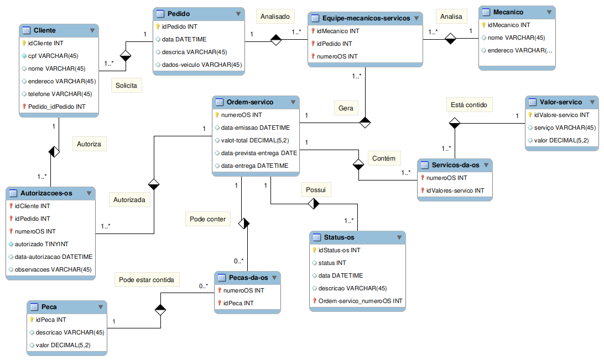

# Projeto ER Ordem Serviço Oficina
Projeto Modelagem ER OS Oficina, Bootcamp Database Experience DIO
   

> # Requisitos

## Cliente
* Cliente leva veículo à oficina e solicita o pedido do serviço
* Cliente Autoriza a execução da OS
  

## Mecânicos
* Mecânicos Avaliam o pedido do cliente
* Mecânicos abrem a OS com uma data prevista para entrega
* Mecânicos que avaliaram o pedido, executam os serviços da OS
* O cadastro dos mecânicos deve possuir: codigo, nome, endereco e especialidade
  

## Pedido
* Os pedidos são realizados pelos clientes, e deve conter o cliente, a descrição, dados do veículo
* Deve conter no pedido a data e hora em que foi solicitado
  

## Ordem Serviço
* As ordens de serviço são geradas pelos mecânicos que avaliam o pedido
* A ordem de serviço deve conter o pedido, a data de emissão, o valor total dos serviços, data prevista e data da entrega.
* Na ordem de serviço deve conter os valores dos serviços realizados, onde, esses valores devem estar em uma tabela de referência. Vários serviços podem compor a ordem de serviço.
* Na ordem de serviço, deve conter as peças peças utilizadas, se for o caso, e seus valores. Várias peças podem compor a ordem de serviço.
* A ordem de serviço possui status, que se modifica a cada etapa de execução, contendo data, e descrição do status.
   

 

